# 15. 플로우차트 (Mermaid)

> 아자스쿨 온라인 멘토링 전체 기능별 플로우차트.
> 각 코드블록을 그대로 복사해 **Notion 코드블록(언어 = Mermaid)** 에 붙여넣으면 다이어그램으로 렌더링됩니다.
> 정책 근거는 PRD `docs/01~14`. 정책 변경 시 본 문서는 `mockup-editor` / `planning-writer` 에이전트가 함께 동기화.

## 목차

- [A. 인증 · 가입 · 탈퇴](#a-인증--가입--탈퇴)
- [B. 멘토 운영](#b-멘토-운영)
- [C. 예약 · 결제](#c-예약--결제)
- [D. 상담 진행](#d-상담-진행)
- [E. 일정 변경 · 취소](#e-일정-변경--취소)
- [F. 패널티 체계](#f-패널티-체계)
- [G. 정산](#g-정산)
- [H. 후기](#h-후기)
- [I. 알림](#i-알림)
- [J. 관리자 운영](#j-관리자-운영)
- [K. 고객지원](#k-고객지원)

---

## A. 인증 · 가입 · 탈퇴

### A-1. 통합 가입 플로우 (소셜 → 역할 → 약관 → 본인인증 → 정보입력)

`docs/03 §11-1` 근거. 약관 동의는 본인인증보다 반드시 앞.

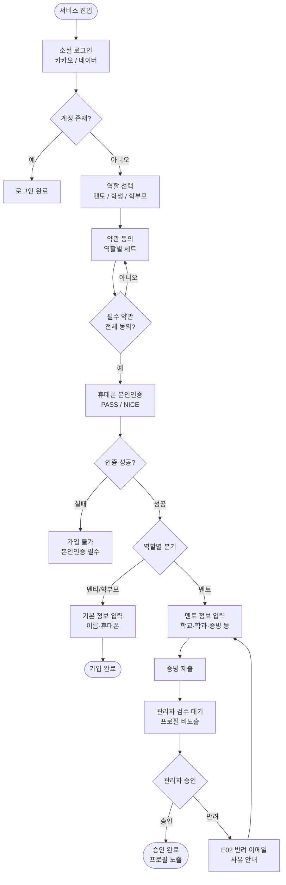

### A-2. 만 14세 미만 자녀 등록 (T09 법정대리인 동의)

`docs/03 §18-7` 근거.

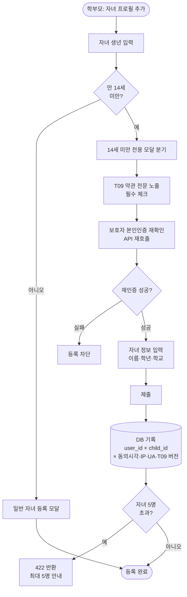

### A-3. 멘티 / 학부모 탈퇴

`docs/03 §18-9` 근거.

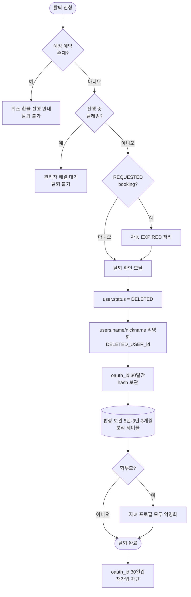

### A-4. 멘토 탈퇴

`docs/03 §18-10` 근거.

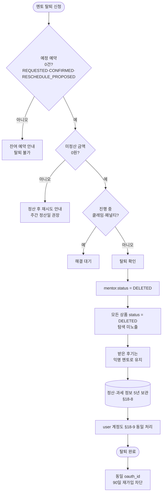

---

## B. 멘토 운영

### B-1. 멘토 가입 심사 (관리자 승인)

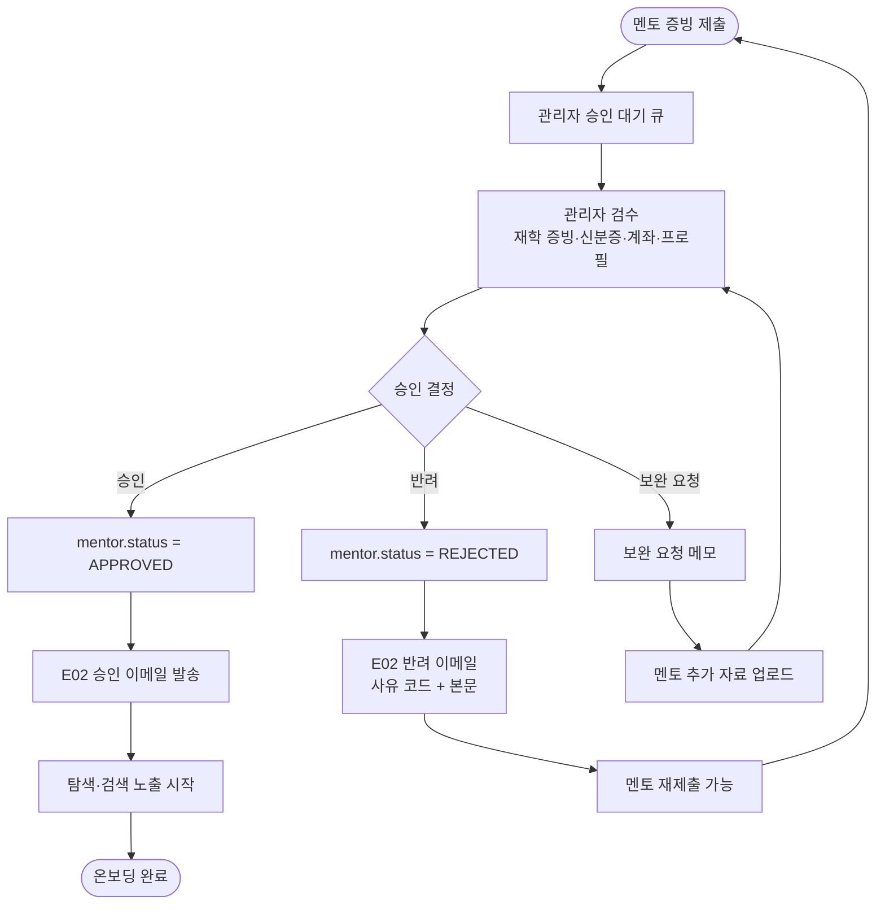

### B-2. 멘토 프로필 수정 → 재심사 분기

`docs/04 프로필 수정 시 재심사 정책`.

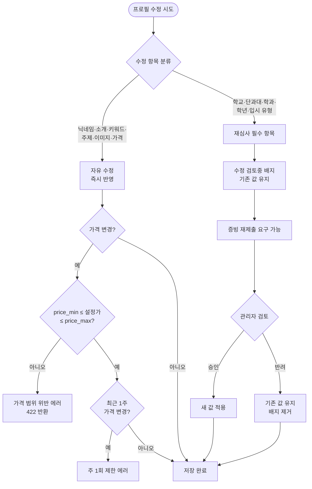

### B-3. 멘토링 상품 상태 전이

`docs/04 상품 수정·삭제 정책`.

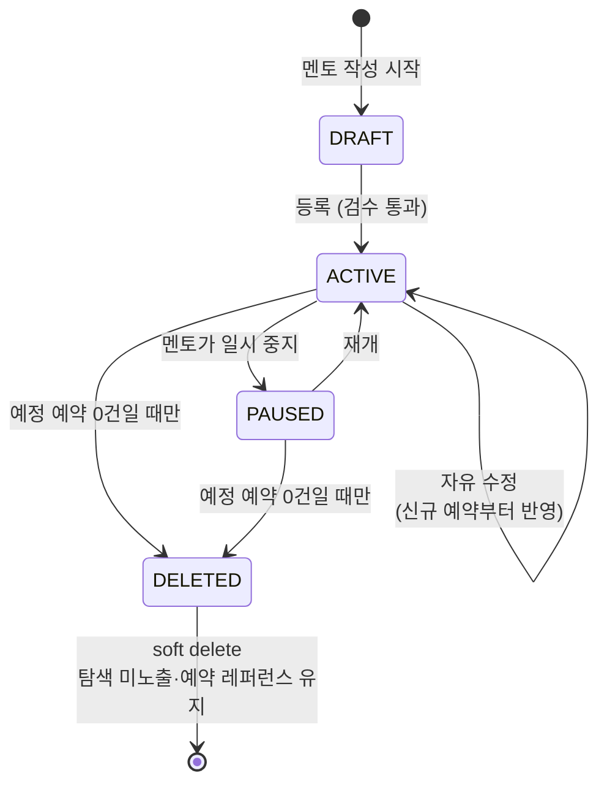

### B-4. 멘토 가능시간 슬롯 등록 / 삭제

`docs/05 멘토 가능시간 등록 리드타임`.

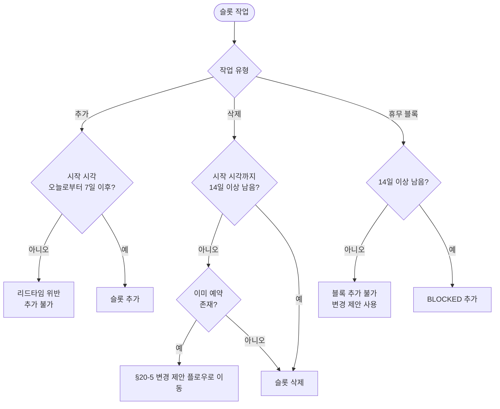

### B-5. 멘토 휴가 (ON_LEAVE)

`docs/05 멘토 자발적 일시정지`.

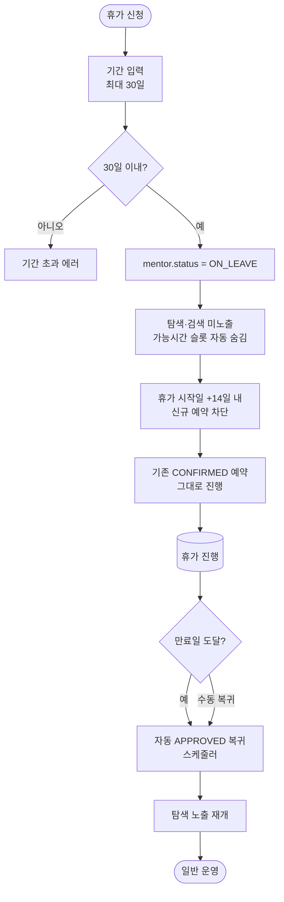

---

## C. 예약 · 결제

### C-1. 멘티 예약 결제 메인 플로우 (자동 확정)

`docs/05 §11-4` + `docs/07 §21-6`.

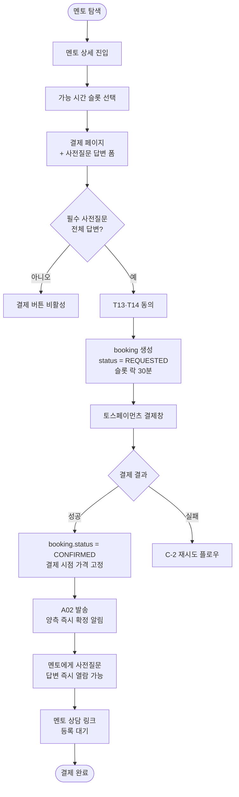

### C-2. 결제 실패 · 재시도 (30분 / 3회)

`docs/07 §21-6`.

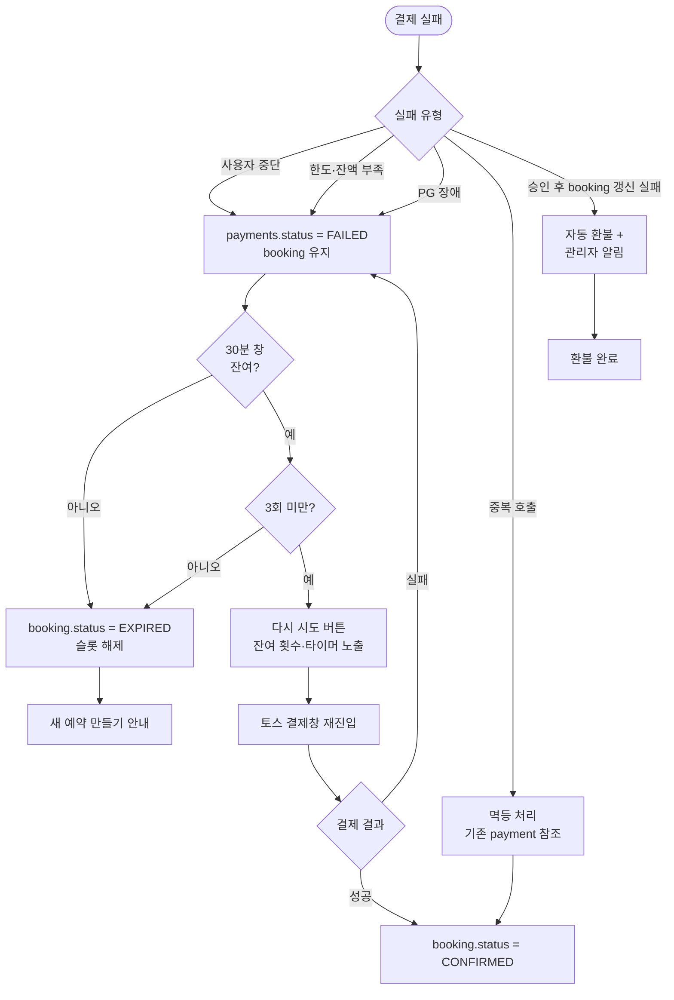

### C-3. 예약 상태 전이 (전체 stateDiagram)

`docs/05 §20-1`.

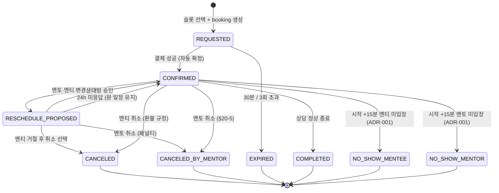

---

## D. 상담 진행

### D-1. 상담 링크 등록 → 입장

`docs/05 §11-7` + `§20-4`.

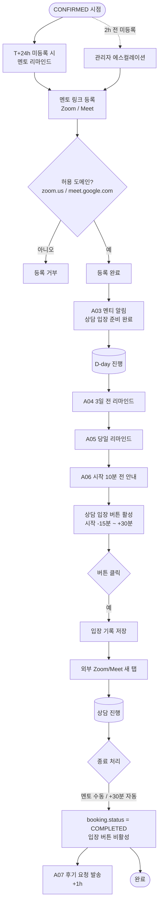

### D-2. 노쇼 판정 (자동 + 신고 폴백)

`docs/05 §20-3` + `docs/11 ADR-001`. v1.2부터 자동 판정·자동 환불 도입, 시간 기준 +15분으로 통일.

```mermaid
flowchart TD
    Start([상담 시작 시각]) --> Branch{경로}
    Branch -->|"멘티/멘토 신고<br/>(시작 ~ +15분 사이)"| Reported["신고 접수<br/>noshow_detection_source = REPORTED"]
    Branch -->|시작 +15분 cron| Auto["시스템 자동 검사<br/>noshow_detection_source = AUTO"]

    Auto --> CheckEntry{session_entry_log<br/>입장 row}
    CheckEntry -->|양측 입장 ≥1| Normal[정상 진행<br/>판정 종료]
    CheckEntry -->|멘토 0 / 멘티 ≥1| MentorNoShow[NO_SHOW_MENTOR 확정]
    CheckEntry -->|멘티 0 / 멘토 ≥1| MenteeNoShow[NO_SHOW_MENTEE 확정]
    CheckEntry -->|양측 0| Both["양측 노쇼 확정<br/>noshow_detection_source = BOTH"]

    Reported --> Verify{입장 row 검증}
    Verify -->|일치| RouteR{신고 대상}
    Verify -->|충돌<br/>(상대 입장 row 1건 등)| AdminConflict[관리자 검토 큐<br/>이의 처리]
    RouteR -->|멘토 노쇼 신고| MentorNoShow
    RouteR -->|멘티 노쇼 신고| MenteeNoShow

    MentorNoShow --> RefundFull[100% 자동 환불<br/>토스페이먼츠 API]
    Both --> RefundFull
    MenteeNoShow --> NoRefund[환불 없음<br/>멘토 전액 수령]

    RefundFull --> RefundResult{환불 API 결과}
    RefundResult -->|성공| Penalty
    RefundResult -->|실패| AdminFail[refund.status = FAILED<br/>관리자 수동 재처리 큐]
    AdminFail --> Penalty
    NoRefund --> Penalty

    Penalty[패널티 카운트 적용]
    MentorNoShow -.-> P1[멘토 §20-5 카운트 +2]
    MenteeNoShow -.-> P2[멘티 §20-8 카운트 +1]
    Both -.-> P3[양측 카운트 모두 적용]

    Penalty --> Notify[관리자 슬랙 + 대시보드<br/>'노쇼 자동 처리 큐' 사후 알림]
    Notify --> End([판정·환불 완료])
    AdminConflict --> End
```

> 자동·신고 모두 결과는 동일(상태·환불·패널티). 멘티 신고는 +15분 이전 폴백, +15분 시점부터는 자동 판정이 우선. 양측 노쇼·환불 실패·자동/신고 충돌은 관리자 사후 검토 큐로 자동 이관.

### D-3. 사전질문지 운영

`docs/08 §11-8`.

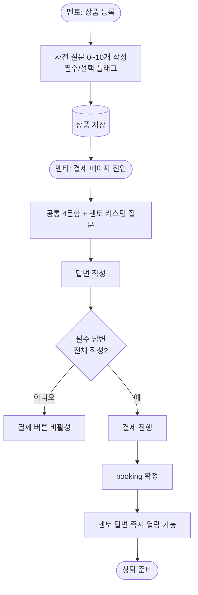

---

## E. 일정 변경 · 취소

### E-1. 멘토 일정 변경 제안

`docs/05 §20-2` + `§20-5`.

```mermaid
flowchart TD
    Start([멘토 변경 제안 시도]) --> TimeCheck{상담 시작까지<br/>72h 이상?}
    TimeCheck -->|아니오| Block[변경 불가<br/>취소만 가능]
    TimeCheck -->|예| OnceCheck{이 건 변경<br/>이미 1회 사용?}
    OnceCheck -->|예| BlockOnce[건당 1회 제한]
    OnceCheck -->|아니오| Slots[대체 슬롯 3개 제시 의무]
    Slots --> Reason[사유 코드 선택<br/>R01~R05]
    Reason --> Send[booking.status = RESCHEDULE_PROPOSED]
    Send --> NotifyA01[A01 멘티에게 알림]
    NotifyA01 --> MenteeAct{멘티 응답}
    MenteeAct -->|승인 (택1)| Accept[새 일정으로 CONFIRMED]
    MenteeAct -->|전체 거절| Decision{멘티 선택}
    MenteeAct -->|24h 미응답| AutoKeep[원 일정 자동 유지]
    Decision -->|원 일정 유지| Keep[CONFIRMED 복귀]
    Decision -->|취소 선택| MentorCancel[멘토 취소<br/>F-1 패널티 적용]
    Accept --> End([변경 완료])
    Keep --> End
    AutoKeep --> End
```

### E-2. 멘티 일정 변경 제안

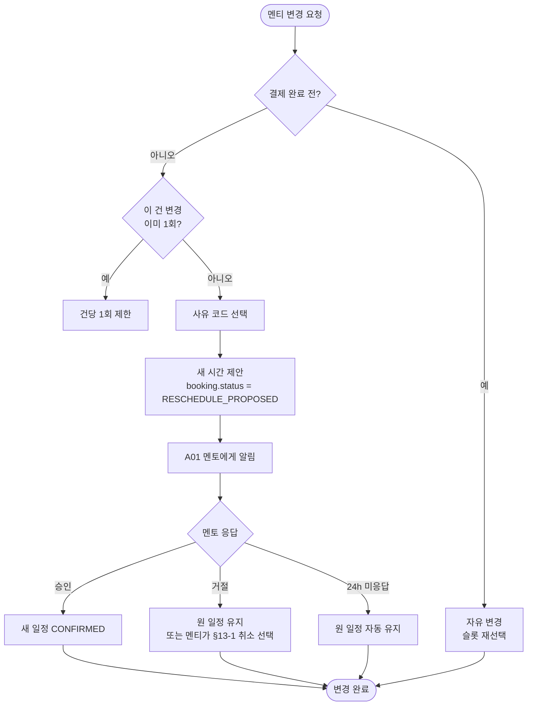

### E-3. 멘티 취소 · 환불

`docs/11 §13-1`.

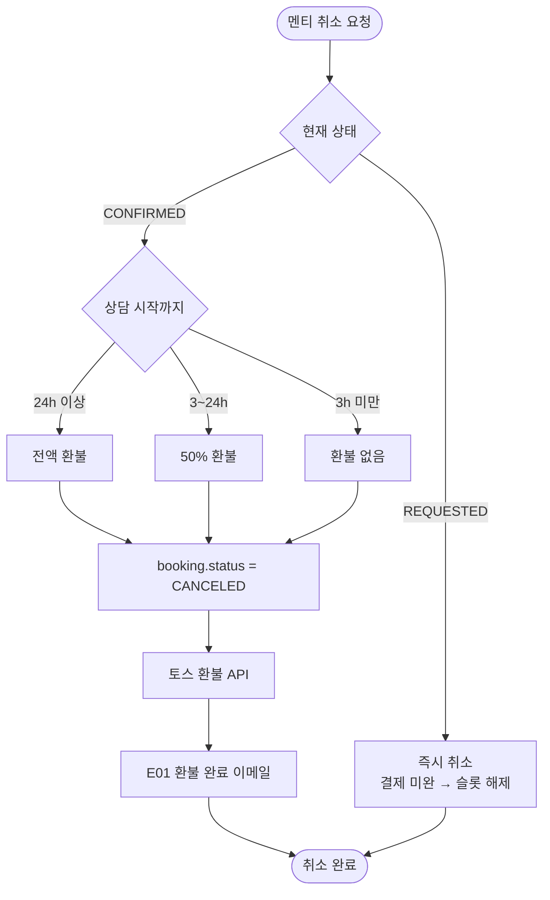

### E-4. 멘토 취소 (§20-5 패널티 적용)

`docs/05 §20-5`.

```mermaid
flowchart TD
    Start([멘토 취소 시도]) --> TimeBucket{상담 시작까지}
    TimeBucket -->|72h 이상| W1[가중치 +1]
    TimeBucket -->|72h~24h| W2[가중치 +1]
    TimeBucket -->|24h 미만| W3[가중치 +2]
    W1 --> Reason[사유 코드 선택<br/>R01~R05]
    W2 --> Reason
    W3 --> Reason
    Reason --> Emergency{긴급 면제 신청?}
    Emergency -->|예| AdminCheck[관리자 검토<br/>증빙 첨부]
    AdminCheck -->|승인| Exempt[패널티·카운트 면제<br/>연 2회 차감]
    AdminCheck -->|반려| Apply
    Emergency -->|아니오| Apply[현재 누적 카운트 + 가중치]
    Apply --> StageCalc[F-1 단계 계산]
    StageCalc --> Cancel[booking.status = CANCELED_BY_MENTOR]
    Cancel --> RefundFull[멘티 전액 환불]
    RefundFull --> Coupon[쿠폰 1매 보상 (런칭 후)]
    Coupon --> NotifyMentee[A01-style 알림 + E01]
    Cancel --> Deduct[다음 정산에서 비율 차감]
    StageCalc --> Stage3{누적 ≥ 3?}
    Stage3 -->|예| Suspend1M[프로필 1개월 정지]
    Stage3 -->|아니오| Skip
    StageCalc --> Stage5{누적 ≥ 5?}
    Stage5 -->|예| AccountStop[계정 정지]
    Stage5 -->|아니오| Skip
    Exempt --> End([면제 완료])
    NotifyMentee --> End
```

---

## F. 패널티 체계

### F-1. 멘토 누적 카운트 → 비율 결정 (§20-5)

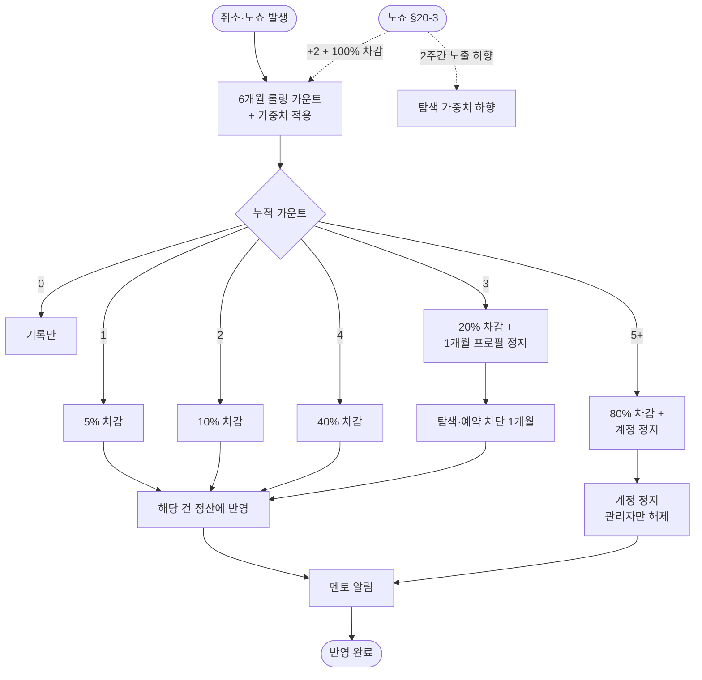

### F-2. 멘티 노쇼 5단계 제재 (§20-8)

```mermaid
flowchart TD
    Trigger([NO_SHOW_MENTEE 확정]) --> Add[6개월 롤링 카운트 +1]
    Add --> N{누적 노쇼}
    N -->|1| L1[경고 알림톡<br/>기록만]
    N -->|2| L2[경고 + 다음 예약 시<br/>방지 안내 모달 강제]
    N -->|3| L3[24h 신규 예약<br/>쿨다운]
    N -->|4| L4[72h 쿨다운 +<br/>경고 배지]
    N -->|5| L5[계정 정지 30일<br/>관리자 영구정지 가능]
    L1 --> NoRefund[환불 없음<br/>멘토 전액 수령]
    L2 --> NoRefund
    L3 --> NoRefund
    L4 --> NoRefund
    L5 --> NoRefund
    NoRefund --> Emergency{긴급 면제 신청?<br/>연 2회}
    Emergency -->|승인| Reset[해당 건 카운트 면제]
    Emergency -->|아니오/반려| End([반영 완료])
    Reset --> End
```

### F-3. 외부 연락처 노출 3단계 제재 (§13-5)

```mermaid
flowchart TD
    Save([프로필·상품·후기 저장]) --> Detect[정규식 자동 탐지<br/>전화·이메일·URL]
    Detect --> Found{탐지?}
    Found -->|아니오| Ok[저장 완료]
    Found -->|예| Reject[저장 거부 + 에러]
    Reject --> Manual[수동 신고도 접수]
    Manual --> Counted[적발 카운트 +1]
    Counted --> Stage{누적}
    Stage -->|1차| W1[경고 + 강제 삭제]
    Stage -->|2차| W2[7일간 신규 상품 등록 제한]
    Stage -->|3차| W3[계정 정지 30일 +<br/>해당 기간 정산 보류]
    Stage -->|명백한 사기| Perm[즉시 영구 정지 +<br/>수사기관 신고 가능]
    W1 --> End([제재 적용])
    W2 --> End
    W3 --> End
    Perm --> End
    Ok --> End2([정상])
```

### F-4. 긴급 사유 면제 신청 (§20-7)

```mermaid
flowchart TD
    Start([마이페이지: 긴급 사유 신고]) --> Quota{연 2회<br/>잔여?}
    Quota -->|아니오| Block[일반 패널티 그대로 적용]
    Quota -->|예| Upload[증빙 업로드<br/>진단서·사고 증명 등]
    Upload --> Submit[관리자 검토 요청]
    Submit --> Review{관리자 검토}
    Review -->|승인| Exempt[해당 건 패널티 + 카운트 면제]
    Review -->|반려| Apply[일반 패널티 적용]
    Review -->|허위 의심| Investigate[조사]
    Investigate -->|허위 확정| Severe[즉시 계정 정지 +<br/>기존 면제분 소급 패널티]
    Investigate -->|진본| Exempt
    Exempt --> End([면제 완료])
    Apply --> End
    Severe --> End
    Block --> End
```

---

## G. 정산

### G-1. 주간 정산 사이클

`docs/07 §21-5` + `§21-7`.

```mermaid
flowchart TD
    Mon([매주 월요일 00:00]) --> Pick[전주 월~일 COMPLETED 건<br/>+ 환불 가능 기간 3일 경과]
    Pick --> Loop[(건별 계산)]
    Loop --> Calc[정산 금액 계산]
    Calc --> CalcDetail["price - platform_fee 50%<br/>= 멘토 총 보상"]
    CalcDetail --> WithholdCalc[원천징수 3.3% 차감]
    WithholdCalc --> PenaltyCalc{§20-5 적용?}
    PenaltyCalc -->|예| Deduct[비율 차감]
    PenaltyCalc -->|아니오| NoDeduct
    Deduct --> Final[최종 실수령액]
    NoDeduct --> Final
    Final --> Holiday{월요일이 공휴일?}
    Holiday -->|예| NextDay[다음 영업일 이체]
    Holiday -->|아니오| Pay[은행 이체]
    NextDay --> Pay
    Pay --> NotifyA08[A08 멘토에게 정산 완료 알림]
    NotifyA08 --> Detail[멘토 대시보드<br/>정산 상세 노출]
    Detail --> End([정산 완료])
```

### G-2. 환불 → 멘토 정산 차감 흐름

```mermaid
flowchart TD
    Refund([환불 발생]) --> Type{환불 시점}
    Type -->|정산 전| Pre[정산 계산에서 제외]
    Type -->|정산 후| Post[다음 주 정산에서 차감]
    Pre --> Calc[정산액 재계산]
    Post --> NextWeek[다음 주 정산 row에<br/>음수 항목 추가]
    Calc --> Final[최종 정산]
    NextWeek --> Final
    Final --> Notify[멘토에게 차감 사유 명시]
    Notify --> End([반영 완료])
```

---

## H. 후기

### H-1. 후기 작성 · 수정 · 삭제 · 답글 (§11-9)

```mermaid
flowchart TD
    Complete([booking.status = COMPLETED]) --> A07[A07 후기 요청 알림<br/>+1h]
    A07 --> Open[멘티 후기 작성<br/>14일 기한]
    Open --> Submit[후기 저장]
    Submit --> Aggregate[avg_rating·review_count 재계산]
    Aggregate --> Visible[멘토 프로필 노출]
    Visible --> EditWindow{작성 후 7일 내?}
    EditWindow -->|예| Edit[멘티 1회 수정 가능<br/>이력 보존]
    EditWindow -->|아니오| ExpireEdit[수정 기한 만료 안내]
    Visible --> DelWindow{작성 후 30일 내?}
    DelWindow -->|예| SelfDelete[멘티 본인 삭제]
    DelWindow -->|아니오| AdminDelete[관리자 경유 삭제]
    SelfDelete --> Aggregate
    AdminDelete --> Aggregate
    Visible --> ReplyCheck{멘토 답글?}
    ReplyCheck -->|예| Reply[해당 멘토만 답글 1회]
    Reply --> ReplyEdit[답글도 7일 수정 / 30일 삭제]
    Edit --> Aggregate
    ExpireEdit --> Visible
```

### H-2. 후기 신고 처리

```mermaid
flowchart TD
    Report([부적절 후기 신고]) --> Queue[관리자 검토 큐]
    Queue --> Review{관리자 판단}
    Review -->|타당| Hide[is_hidden = true<br/>hidden_reason 코드 부여]
    Review -->|기각| Keep[후기 유지]
    Keep --> Track[신고자 기각 카운트 +1]
    Track --> Abuse{30일 내 5회 이상 기각?}
    Abuse -->|예| Warn[신고자 계정 경고]
    Abuse -->|아니오| End
    Hide --> Recalc[avg_rating 재계산]
    Recalc --> Notify[양측 알림]
    Notify --> End([처리 완료])
    Warn --> End
```

---

## I. 알림

### I-1. 알림톡 발송 → SMS 폴백

`docs/06`.

```mermaid
flowchart TD
    Trigger([트리거 발생]) --> Code{알림 코드<br/>A01~A08 / E01~E02}
    Code -->|A01~A08| Bizm[카카오 알림톡 시도]
    Code -->|E01~E02| SES[AWS SES 이메일]
    Bizm --> BizmResult{발송 성공?}
    BizmResult -->|성공| LogOk[(notification_log 저장)]
    BizmResult -->|실패| Fallback[SMS / LMS 폴백]
    Fallback --> SmsResult{SMS 성공?}
    SmsResult -->|성공| LogOk
    SmsResult -->|실패| Alert[관리자 슬랙 경보]
    Alert --> ManualRetry[관리자 수동 재발송]
    ManualRetry --> Bizm
    SES --> EmailResult{발송 성공?}
    EmailResult -->|성공| LogOk
    EmailResult -->|실패| Alert
    LogOk --> End([완료])
```

### I-2. 예약 라이프사이클 알림 타임라인

```mermaid
flowchart LR
    Pay([결제 완료]) --> A02[A02 양측 확정]
    A02 --> Reg([멘토 링크 등록])
    Reg --> A03[A03 멘티 입장 준비 완료]
    A03 --> D3[D-3]
    D3 --> A04[A04 3일 전 리마인드]
    A04 --> D0[D-day]
    D0 --> A05[A05 당일 리마인드]
    A05 --> M10[시작 -10분]
    M10 --> A06[A06 입장 안내]
    A06 --> Session([상담])
    Session --> Comp([COMPLETED])
    Comp --> H1[+1h]
    H1 --> A07[A07 후기 요청]
    Comp --> Settle([주간 정산])
    Settle --> A08[A08 정산 완료]
    A08 --> End([종료])
    Comp -.->|환불 발생 시| E01[E01 환불 완료 이메일]
```

---

## J. 관리자 운영

### J-1. 클레임 처리

`docs/11 §13-2`.

```mermaid
flowchart TD
    Submit([멘티/멘토 클레임 접수]) --> Categorize[카테고리 분류<br/>시간미준수·무성의·허위·언행 등]
    Categorize --> Queue[관리자 처리 큐]
    Queue --> Investigate[양측 진술 + 입장 기록 확인]
    Investigate --> Decision{판정}
    Decision -->|멘토 유책| MentorFault[전액 환불 + §20-5 카운트]
    Decision -->|멘티 유책| MenteeFault[환불 없음<br/>필요 시 §20-8 카운트]
    Decision -->|쌍방·기타| Compromise[부분 환불 / 쿠폰 보상 / 양측 경고]
    Decision -->|허위 신고| FalseReport[신고자 경고]
    MentorFault --> NotifyA[양측 알림 + E01]
    MenteeFault --> NotifyB[양측 알림]
    Compromise --> NotifyC[양측 알림]
    FalseReport --> NotifyD[신고자 알림]
    NotifyA --> Close[클레임 종결]
    NotifyB --> Close
    NotifyC --> Close
    NotifyD --> Close
    Close --> End([종료])
```

### J-2. 관리자 멘토 승인 큐

```mermaid
flowchart TD
    NewSignup([신규 멘토 가입 + 증빙 제출]) --> Queue[관리자 승인 대기 큐]
    Queue --> Pick[건 선택]
    Pick --> Verify[학교 이메일 / 재학 증빙 / 신분증 / 계좌 / 프로필 텍스트 검수]
    Verify --> ExternalCheck[외부 연락처·허위 표현 탐지]
    ExternalCheck --> Decide{결정}
    Decide -->|승인| Approve[mentor.status = APPROVED]
    Decide -->|반려| Reject[mentor.status = REJECTED + 사유]
    Decide -->|보완 요청| Hold[보완 요청 메모<br/>멘토에게 알림]
    Approve --> Email1[E02 승인 이메일]
    Reject --> Email2[E02 반려 이메일 + 사유]
    Hold --> Email3[보완 안내 이메일]
    Email1 --> End([큐에서 제거])
    Email2 --> Resubmit[멘토 재제출 → 큐 재진입]
    Email3 --> Resubmit
    Resubmit --> Queue
```

---

## K. 고객지원

### K-1. 1:1 문의 (§23-1)

```mermaid
flowchart TD
    Open([고객센터 진입]) --> Cat[카테고리 선택<br/>계정·결제·예약·기타]
    Cat --> Write[문의 작성 + 첨부]
    Write --> Submit[티켓 생성]
    Submit --> Queue[관리자 처리 큐]
    Queue --> Reply[답변 작성<br/>SLA 영업일 1일]
    Reply --> Notify[알림 발송]
    Notify --> Read[멘티/멘토 확인]
    Read --> Followup{추가 문의?}
    Followup -->|예| Write
    Followup -->|아니오| Close[티켓 종료]
    Close --> End([종료])
```

### K-2. 약관 개정 → 재동의 인터셉트 (§18-5)

```mermaid
flowchart TD
    Update([관리자: 약관 본문 갱신]) --> Version[버전 + 시행일 등록]
    Version --> Live[(약관 시행)]
    Live --> Login([기존 사용자 로그인])
    Login --> Check{새 버전<br/>미동의?}
    Check -->|아니오| Pass[정상 진입]
    Check -->|예| Intercept[재동의 화면 인터셉트]
    Intercept --> Diff[변경점 요약 노출]
    Diff --> Action{사용자 선택}
    Action -->|동의| Save[(동의 이력 저장)]
    Action -->|거부| Limit[멘토 활동 일시 중단<br/>또는 서비스 제한]
    Save --> Pass
    Limit --> End([제한 안내])
    Pass --> End2([서비스 진입])
```

---

## 사용 메모

- **노션 붙여넣기**: 노션에서 `/code` → 언어를 `Mermaid` 로 변경 → 위 코드블록 내용 복붙.
- **렌더링 안 될 때**: 노션 코드블록 우상단 토글에서 `Preview` 활성화. 일부 워크스페이스에서 Mermaid 미리보기를 켜야 함.
- **수정 우선순위**: 본 문서 → `mockups/` 의 해당 화면 → 백엔드 상태 머신 SQL 순서로 동기화. SoT 는 `docs/01~14` 본문.
- **신규 플로우 추가 시**: `planning-writer` 가 PRD 본문 갱신 → `mockup-editor` 가 본 문서 + 목업 갱신.
